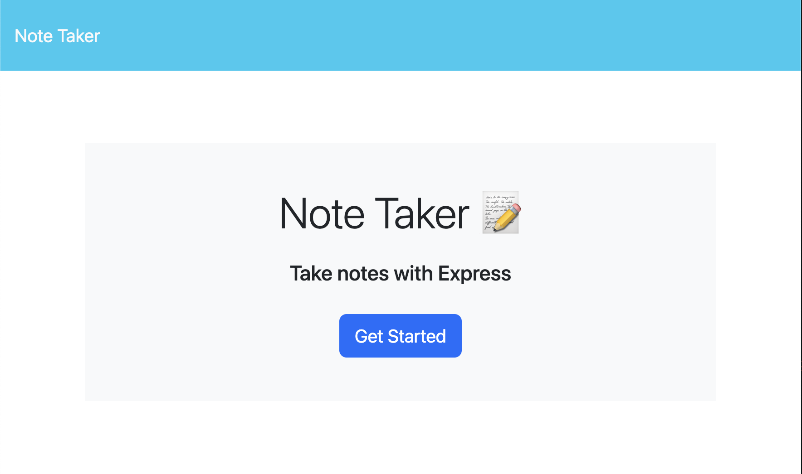
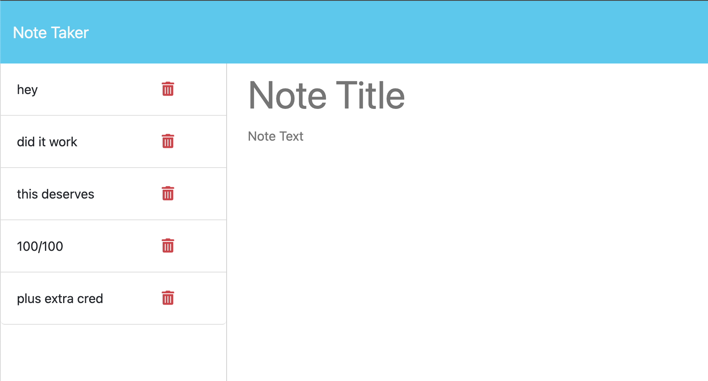

# NoteThis

## Description 📰

NoteThis makes and deletes notes using a backend server.
The motivation behind making this application was to learn how to utilize a backend to host files that can be rendered anywhere. Something I noticed was this works almost like localStorage in a sense. We `GET` the item, in this case, a JSON object, and we post/write manipulated content/data to a file, essentially setting the item. However, the main difference between both methods, of course, is that localStorage is just that -- local. The content saved varies by user, machine, and ultimately browser. Upon testing this app, I did notice that whatever is saved in the app is still saved everywhere for this app. So what is saved in these app will still render in any other platform as well, showcasing the power of a backend server! I also learned a lot about the logic behind using route handlers as well as how to organize/modularize routing codes.
This app is the first of many to come that is deployed on Heroku!

## Table of Contents

&nbsp;&nbsp;&nbsp;&nbsp;&nbsp;&nbsp; ➣ [Installation](#Installation)

&nbsp;&nbsp;&nbsp;&nbsp;&nbsp;&nbsp; ➣ [Usage](#Usage)

&nbsp;&nbsp;&nbsp;&nbsp;&nbsp;&nbsp; ➣ [Contributing](#Contributing)

&nbsp;&nbsp;&nbsp;&nbsp;&nbsp;&nbsp; ➣ [Tests](#Tests)

&nbsp;&nbsp;&nbsp;&nbsp;&nbsp;&nbsp; ➣ [Credits](#Credits)

&nbsp;&nbsp;&nbsp;&nbsp;&nbsp;&nbsp; ➣ [Questions](#Questions)

## Installation 🔌

In order to install, please run `npm i express`.

## Usage 🧮

The user clicks 'Get started' on the homepage, and it will direct them to the notes path.  
  
Once in the note path, the user can type notes, save them, and delete them.  
  
  
In order to use this app, please visit the deployed [Note Taker](https://notethis-895d3e5dc26b.herokuapp.com/) app!

## Contributing 🍴

In order to contribute, one must fork their repository and create a pull request.

 ## Credits 🤝
  edX: fsUtils.js and uuid.js

## Questions 📭

Please enjoy my work at my GitHub, @[mintyry](https://github.com/mintyry).
